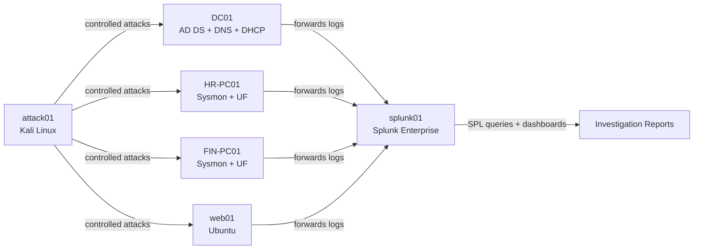

# SOC Lab 03 — SOC Investigation

Hands-on SOC investigation lab: controlled attacks executed from Kali Linux against a domain-joined enterprise environment (`ashag.local`), detected and investigated in Splunk, and documented as individual incident reports mapped to MITRE ATT&CK.

This repo is the investigation layer of my home SOC lab. The infrastructure — Active Directory, DHCP, Splunk indexer, Universal Forwarders, Sysmon — is built following [soc-lab-01-small-enterprise](https://github.com/ashagmp/soc-lab-01-small-enterprise) and [soc-lab-02-enterprise-siem](https://github.com/ashagmp/soc-lab-02-enterprise-siem); this repo is where the attack → detect → investigate → report cycle against that environment is documented.

## Objective

Simulate realistic attacker behavior against a small enterprise AD environment, detect it using Splunk, and produce SOC L1-style investigation reports — the same artifact a hiring manager would expect to see from someone who's actually done the work, not just studied the theory.

## Architecture



## Lab Environment

Domain: `ashag.local` (NetBIOS: `ASHAG`) — internal network `192.168.10.0/24` (AshagLab)

| VM | IP | Purpose | Status |
|---|---|---|---|
| DC01 | 192.168.10.10 | AD DS, DNS, DHCP | ✅ |
| HR-PC01 | DHCP (.100-.200) | Windows 11, domain-joined, user `hruser`, Sysmon + UF | ✅ |
| FIN-PC01 | DHCP (.100-.200) | Windows 11, domain-joined, user `finuser`, Sysmon + UF | ✅ |
| web01 | 192.168.10.20 | Ubuntu Server, Splunk UF | ✅ |
| splunk01 | 192.168.10.40 | Splunk Enterprise (indexer / search head) | ✅ |
| attack01 | 192.168.10.70 | Kali Linux — controlled attack simulation | ✅ |

Indexes: `windows` (Security + Sysmon, split by sourcetype), `linux`

## Repository Structure

```
soc-lab-03-soc-investigation/
├── README.md
├── investigations/          # One report per attack scenario
│   ├── 00-template.md
│   ├── 01-<technique-name>.md
│   └── ...
├── detections/               # Saved SPL queries used across investigations
│   └── <detection-name>.spl
├── dashboards/                # Exported dashboard XML/screenshots
│   └── soc-overview.md
├── evidence/                   # Supporting evidence per investigation (any file type)
│   └── 01-<technique-name>/
└── diagrams/                  # Attack flow / network diagrams
```

## Methodology

Each investigation follows the same cycle:

1. **Simulate** — run a controlled attack from attack01 against a target host
2. **Detect** — identify the resulting events in Splunk (raw search first, then a tuned SPL query, or via an existing dashboard panel)
3. **Investigate** — build a timeline, identify IOCs, determine scope and root cause
4. **Map** — tag the technique to its MITRE ATT&CK ID
5. **Document** — write it up using the investigation template
6. **Respond** — note what containment/remediation steps would apply in a real environment

## Dashboards

Core SOC Overview dashboard, built on the `windows`/`linux` indexes:

- Failed Logon Attempts (EventCode 4625)
- Successful Logons (EventCode 4624)
- Account Lockouts (EventCode 4740)
- PowerShell Activity (Sysmon EventCode 1, filtered to powershell.exe)
- Sysmon Process Creation (EventCode 1, by host/image)
- Linux Auth (SSH failed/accepted)

## Investigations Index

| # | Scenario | Target Host | MITRE ATT&CK | Status |
|---|---|---|---|---|
| 01 | [Nmap Recon Scan](investigations/01-nmap-recon-dc01.md) | DC01 | T1046 | ✅ Complete |
| 02 | | | | Planned |
| 03 | | | | Planned |

*(Update this table as each investigation is added — link the scenario name to its file in `investigations/`.)*

## Tools Used

Splunk Enterprise, Sysmon, Active Directory Domain Services, Kali Linux (Nmap, Hydra, Metasploit, etc. — update per investigation), VirtualBox

## Skills Demonstrated

Active Directory administration, log analysis, SPL query writing, detection engineering, MITRE ATT&CK mapping, incident timeline reconstruction, incident report writing.

## Related Work

- [soc-lab-01-small-enterprise](https://github.com/ashagmp/soc-lab-01-small-enterprise) — AD/DNS/DHCP enterprise build
- [soc-lab-02-enterprise-siem](https://github.com/ashagmp/soc-lab-02-enterprise-siem) — Splunk SIEM deployment + dashboards
- [GitHub Profile](https://github.com/ashagmp)
- [LinkedIn](https://linkedin.com/in/ashag-mp-141698210)

## Author

Ashag M P — aspiring SOC Analyst (L1)
